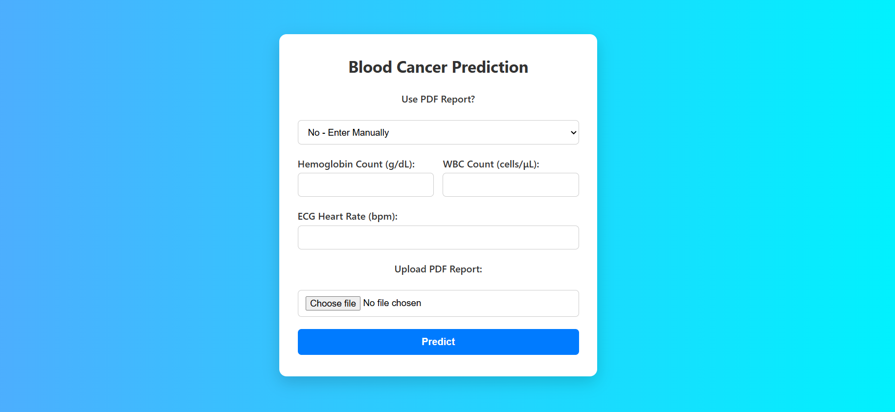
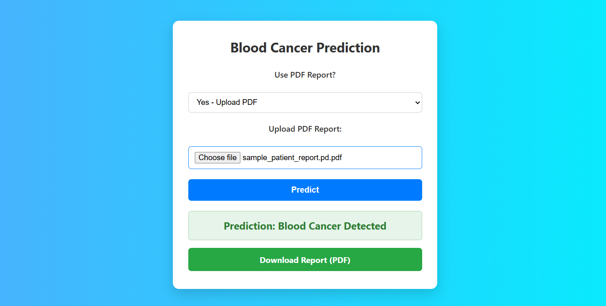
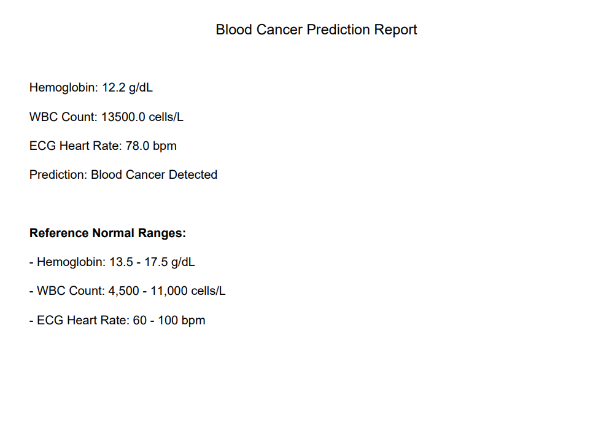
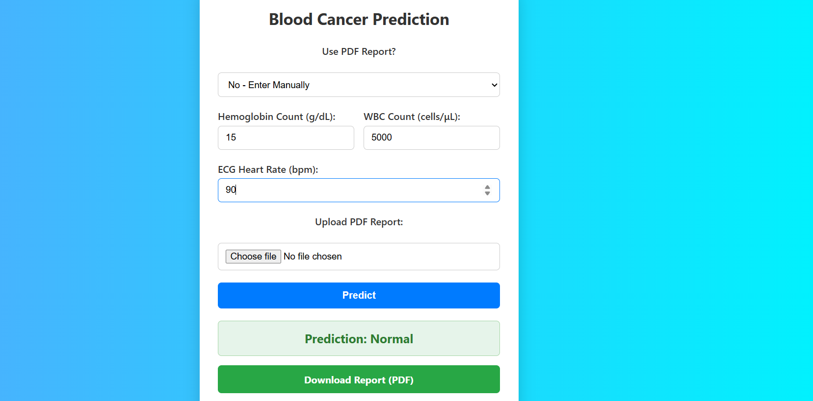
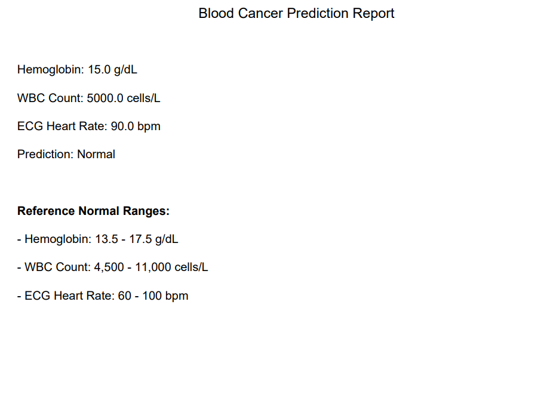

# 🩸 Blood Cancer Prediction Web App

A Flask-based machine learning web application that predicts whether a patient is likely to have **blood cancer** based on three key medical values:

- Hemoglobin level (g/dL)  
- WBC count (cells/μL)  
- ECG heart rate (bpm)

It supports both:
- 📝 **Manual input**
- 📄 **PDF report upload** (with automatic value extraction)

---

## 🚀 Features

- 🔍 Predicts "Blood Cancer" or "Normal" using a trained Decision Tree model
- 📄 Upload a PDF report and extract values using PyMuPDF
- 📊 Downloadable PDF report with prediction and normal ranges
- 🎨 Stylish, responsive user interface
- ✅ Works offline or can be hosted online

---

## 🛠 Tech Stack

- **Frontend**: HTML, CSS  
- **Backend**: Python (Flask)
- **ML Model**: scikit-learn (Decision Tree)
- **PDF Tools**: PyMuPDF (PDF reader), FPDF (PDF generator)

---

## 🧪 How to Run Locally

### ✅ Requirements
- Python 3.7+
- `pip` package installer

---

### 🔧 Setup Instructions

1. Clone this repository:

  git clone https://github.com/Abisha9328/blood-cancer-predictor.git
  cd blood-cancer-predictor

2.Install all dependencies:

  pip install -r requirements.txt

3.Add your dataset file to the root directory:

  blood_cancer_with_binary_labels.csv

Required columns:
  Haemoglobin
  WBC count
  ECG / Heart rate
  label_binary (0 = Normal, 1 = Blood Cancer)

4.Train the model:
  python train_model.py
  
5.Run the app:
  python app.py
  
6.Visit the app in your browser:
  http://127.0.0.1:5000

  ## 📄 Sample Files

- 📥 [Download Sample Dataset (CSV)](blood_cancer_with_binary_labels.csv)
- 📥 [Download Sample PDF Report](sample_patient_report.pdf)

## 🖼 Screenshots

### 📝 Manual Input Prediction

### 📄 PDF Upload Prediction

### 🔍 Blood Cancer Prediction

### ✅ Normal Prediction

### 📄 PDF Report Output (Normal)

## 🌐 Live Demo

🚀 Try the app here: [https://blood-cancer-predictor-1.onrender.com](https://blood-cancer-predictor-1.onrender.com)

---

## 🙌 Developed by [Abisha9328](https://github.com/Abisha9328)

If you found this project helpful:
- ⭐ Star the repo
- 🍴 Fork it
- 📢 Share it

Thank you for visiting!

